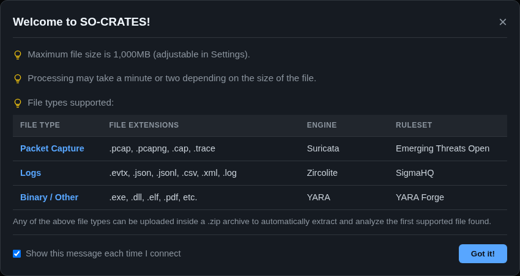
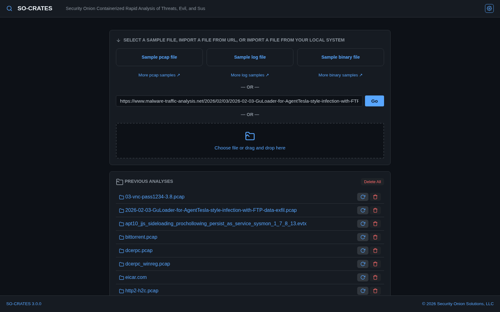
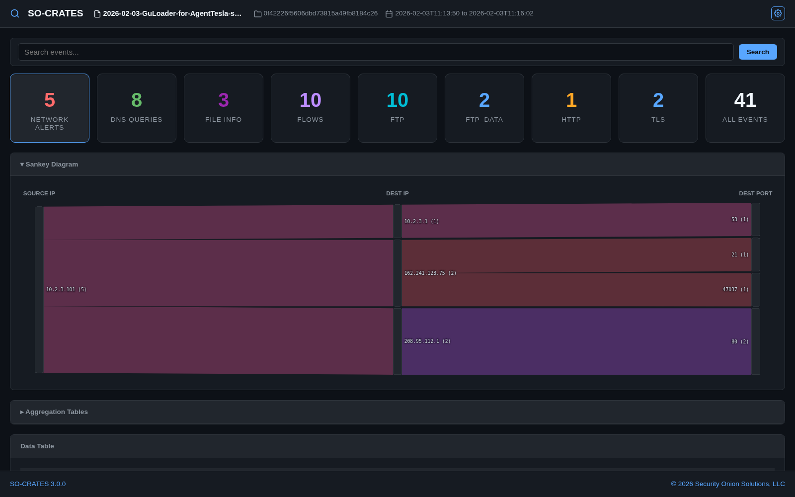
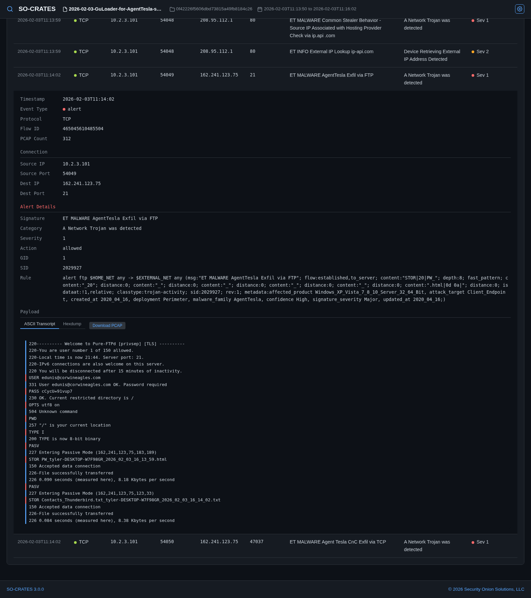
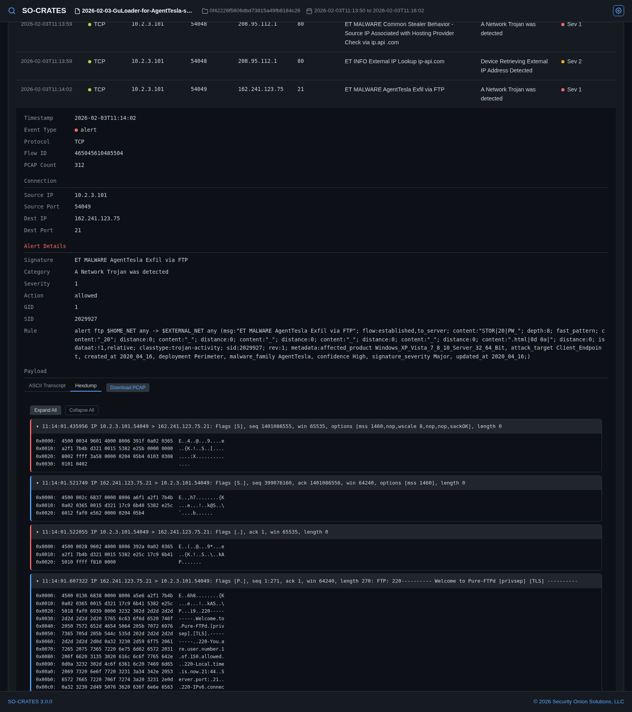
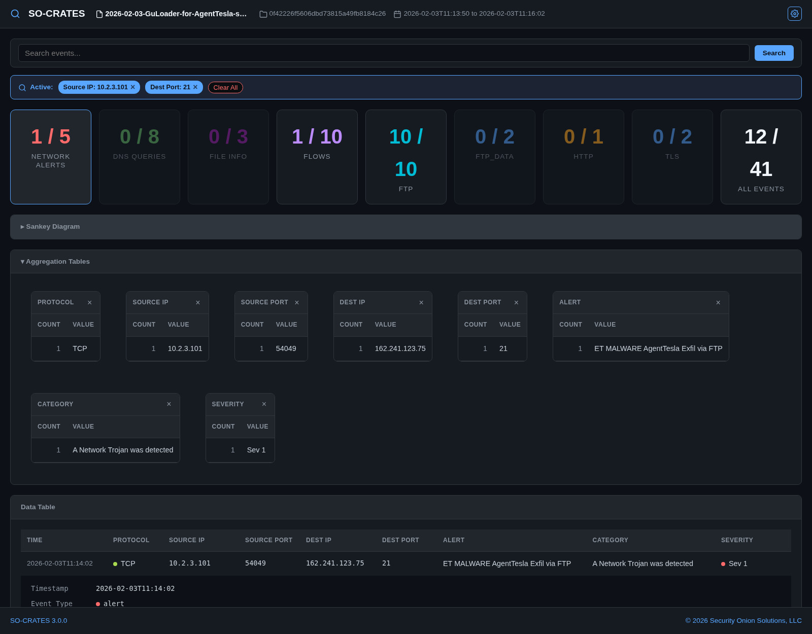

# SO-CRATES

*Security Onion Containerized Rapid Analysis of Threats, Evil, and Sus*

A standalone web application for analyzing pcap files, log files, and binary files. Features include Suricata network analysis, YARA binary scanning, Sigma rule detection for logs, and a single-page UI for browsing alerts, metadata, transcripts, and hexdumps.

Check out the demo video and screenshots below. When you're ready to try it yourself, head to [Interactive Demo](quick-demo.md) or [Installation](installation/index.md).

## Demo Video

A recorded walkthrough of analyzing a pcap: loading the sample file, reviewing each data type, filtering via the Aggregation Tables, and drilling into a single event's ASCII transcript and hexdump.

<video controls width="100%" src="videos/demo.mp4" poster="videos/demo-poster.jpg"></video>

## Screenshots

When you first connect to SO-CRATES, a welcome window will appear with an overview of SO-CRATES:

When you dismiss the welcome window, the main screen allows you to upload a file or load a previous analysis:

After analysis, you can view network alerts, file alerts, network metadata, and extract streams:

When you find something interesting, you can drill into the row in the data table at the bottom. This will allow you to see the ASCII transcript:

You can also select the hexdump view:

To slice and dice your data, expand the Aggregation Tables section and click on values that you want to filter for:

